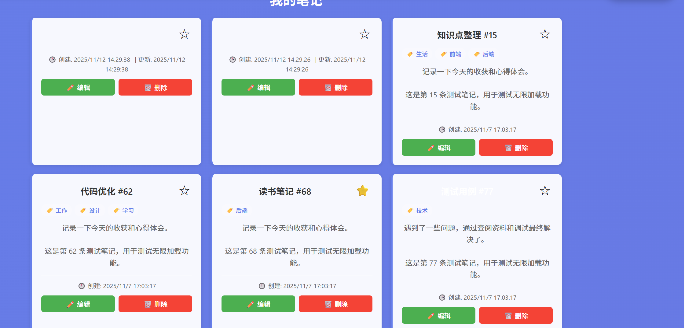
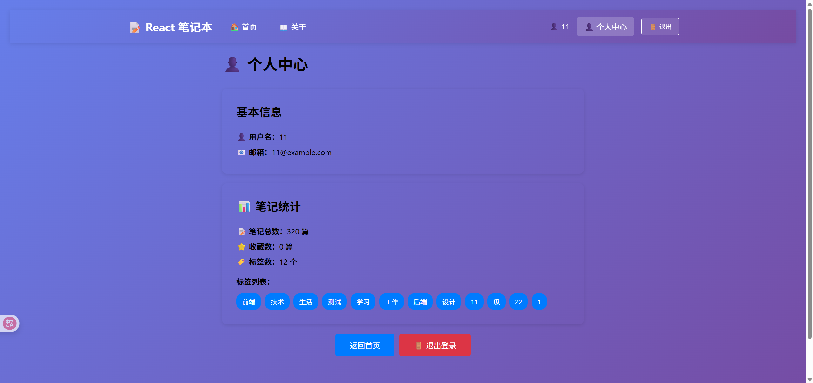

# 📝 React 笔记本 (React Notepad)

一个功能丰富的 React 笔记应用，支持 Markdown 编辑、主题切换、标签管理、搜索筛选等功能。

本人使用学React的过程中边学边开发出的一个项目。

## 📸 部分截图参考：








## ✨ 功能特性

### 📋 核心功能

- **📝 笔记管理**：创建、编辑、删除笔记
- **🔍 搜索与筛选**：支持标题和内容搜索，按标签筛选
- **⭐ 星标收藏**： 标记重要笔记
- **🏷️ 标签系统**：为笔记添加标签，快速分类
- **📊 排序功能**： 按创建时间、更新时间等多种方式排序
- **🖱️ 拖拽排序**： 通过拖拽调整笔记顺序
- **📄 Markdown 支持**： 支持 Markdown 语法编辑和实时预览
- **🌓 主题切换**： 支持浅色/深色模式切换
- **👤 用户认证**：登录/登出功能
- **💾 本地存储**： 数据保存在 localStorage，无需后端
- **🚀 路由导航**： 多页面应用，支持页面跳转

### 🎨 界面特性

- 现代化的 UI 设计
- 响应式布局
- 流畅的动画效果
- 友好的用户体验

## 🛠️ 技术栈

- **React 19.2.0** - UI 框架
- **React Router 7.9.5** - 路由管理
- **Zustand 5.0.8** - 状态管理
- **React Markdown 10.1.0** - Markdown 渲染
- **TypeScript 5.9.3** - 类型支持
- **CSS3** - 样式设计

## 📦 安装与启动

### 环境要求

- Node.js >= 14.0.0
- npm >= 6.0.0

### 安装依赖

```bash
npm install
```

### 启动开发服务器

```bash
npm start
```

应用将在 [http://localhost:3000](http://localhost:3000) 启动。

### 构建生产版本

```bash
npm run build
```

构建后的文件将保存在 `build` 目录中。

### 运行测试

```bash
npm test
```

## 📁 项目结构

```
react-nptepad/
├── public/                 # 静态资源
├── src/
│   ├── components/         # 组件
│   │   ├── Layout.jsx      # 布局组件
│   │   ├── NoteForm.tsx    # 笔记表单
│   │   ├── NoteList.tsx    # 笔记列表
│   │   ├── NoteItem.tsx    # 笔记项
│   │   ├── MarkdownEditor.jsx  # Markdown 编辑器
│   │   ├── ThemeToggle.jsx # 主题切换
│   │   └── ProtectedRoute.jsx  # 路由守卫
│   ├── pages/              # 页面组件
│   │   ├── HomePage.jsx    # 首页
│   │   ├── NoteDetailPage.tsx  # 笔记详情页
│   │   ├── EditNotePage.jsx    # 编辑页
│   │   ├── LoginPage.jsx   # 登录页
│   │   ├── ProfilePage.jsx # 个人中心
│   │   ├── AboutPage.jsx   # 关于页
│   │   └── NotFoundPage.jsx    # 404 页
│   ├── store/              # Zustand 状态管理
│   │   ├── index.ts        # Store 导出
│   │   ├── useNotesStore.ts    # 笔记 Store
│   │   └── useAuthStore.ts     # 认证 Store
│   ├── routes/             # 路由配置
│   │   └── AppRouter.jsx   # 路由组件
│   ├── context/            # Context API
│   │   └── ThemeContext.js # 主题 Context
│   ├── hooks/              # 自定义 Hooks
│   │   ├── useDebounce.js  # 防抖 Hook
│   │   ├── useInfiniteScroll.js  # 无限滚动 Hook
│   │   └── useLocalStorage.js    # 本地存储 Hook
│   ├── types/              # TypeScript 类型定义
│   │   └── index.ts        # 类型导出
│   ├── reducers/           # Reducer
│   │   └── notesReducer.js # 笔记 Reducer
│   ├── App.js              # 根组件
│   └── index.js            # 入口文件
├── docs/                   # 文档目录
├── package.json           # 项目配置
└── README.md                # 项目说明
```

## 🚀 主要功能说明

### 1. 笔记管理

- **创建笔记**：点击表单，输入标题、内容和标签，点击保存
- **编辑笔记**：点击笔记的编辑按钮，或直接跳转到编辑页面
- **删除笔记**：点击笔记的删除按钮
- **查看详情**：点击笔记标题，跳转到详情页

### 2. 搜索与筛选

- **搜索**：在搜索框输入关键词，支持标题和内容搜索
- **标签筛选**：点击标签按钮，筛选对应标签的笔记
- **排序**：支持按创建时间、更新时间等方式排序

### 3. Markdown 编辑

- **编辑模式**：直接输入 Markdown 语法
- **预览模式**：实时预览渲染效果
- **分屏模式**：同时显示编辑和预览

支持的 Markdown 语法：
- 标题 (`#`, `##`, `###`)
- 粗体 (`**文本**`)
- 斜体 (`*文本*`)
- 代码块 (```)
- 链接 (`[文本](url)`)
- 列表 (`-`, `1.`)

### 4. 主题切换

- 点击右上角的主题切换按钮
- 支持浅色模式和深色模式
- 主题偏好保存在 localStorage

### 5. 用户认证

- **登录**：访问 `/login` 页面，输入用户名和密码
- **登出**：点击导航栏的退出按钮
- **个人中心**：登录后可访问 `/profile` 页面

### 6. 路由导航

- `/` - 首页（笔记列表）
- `/notes/:id` - 笔记详情页
- `/edit/:id` - 编辑笔记页
- `/login` - 登录页
- `/profile` - 个人中心（需登录）
- `/about` - 关于页
- `*` - 404 页面

## 💡 使用指南

### 创建第一篇笔记

1. 在首页的笔记表单中输入标题
2. 输入笔记内容（支持 Markdown 语法）
3. 添加标签（可选）
4. 点击"保存笔记"按钮

### 编辑笔记

1. 点击笔记的"编辑"按钮
2. 或点击笔记标题跳转到详情页，再点击编辑
3. 修改内容后点击"保存"

### 搜索笔记

1. 在搜索框输入关键词
2. 笔记列表会实时筛选显示匹配的笔记

### 使用标签

1. 创建笔记时添加标签
2. 点击标签按钮筛选对应标签的笔记
3. 点击"全部"显示所有笔记

### 星标收藏

1. 点击笔记的星标图标
2. 星标笔记会优先显示

### 拖拽排序

1. 按住笔记项
2. 拖动到目标位置
3. 释放鼠标完成排序

## 🔧 开发指南

### 状态管理

本项目使用 Zustand 进行状态管理，主要包含两个 Store：

- **useNotesStore**：管理笔记相关的状态和操作
- **useAuthStore**：管理用户认证相关的状态和操作

### 添加新功能

1. 在 `src/store` 中扩展 Store
2. 在 `src/components` 中创建组件
3. 在 `src/pages` 中创建页面
4. 在 `src/routes/AppRouter.jsx` 中添加路由

### 自定义 Hook

项目提供了几个自定义 Hook：

- `useDebounce`：防抖 Hook
- `useInfiniteScroll`：无限滚动 Hook
- `useLocalStorage`：本地存储 Hook

### 类型定义

TypeScript 类型定义在 `src/types/index.ts` 中，包括：

- `Note`：笔记类型
- `User`：用户类型
- `NotesStore`：笔记 Store 类型
- `AuthStore`：认证 Store 类型

## 📚 文档

更多详细文档请查看 `docs` 目录：

- [路由学习指南](./docs/路由学习指南-初学者版.md)
- [Zustand 使用指南](./docs/状态管理/Zustand使用指南.md)
- [Markdown 功能详解](./docs/Markdown功能详解.md)
- [主题切换功能详解](./docs/主题切换功能详解.md)
- [性能优化详解](./docs/性能优化详解.md)

## 🐛 问题排查

### 数据丢失

- 数据保存在 localStorage 中
- 清除浏览器缓存会导致数据丢失
- 建议定期导出备份

### 页面无法加载

1. 检查 Node.js 版本是否符合要求
2. 删除 `node_modules` 和 `package-lock.json`
3. 重新运行 `npm install`

### 样式问题

- 检查浏览器是否支持 CSS 变量
- 清除浏览器缓存
- 检查主题 Context 是否正常加载


**Happy Coding! 🚀**
